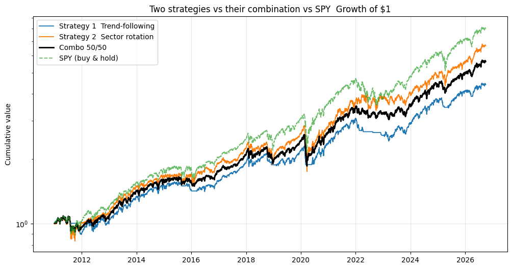

# Equity Strategy Research — Two Simple Strategies vs SPY

Two simple, systematic equity strategies backtested on US sector ETFs (2011 to 2026), compared to SPY. The focus is the research process: a clear economic hypothesis per strategy, point-in-time signals with no look-ahead, realistic transaction costs, and an honest read of what beats the benchmark and what does not.

## Question

Can two simple, distinct trading strategies beat SPY, and what happens when they are combined?

## Data

- 9 US sector ETFs (XLK, XLF, XLV, XLY, XLP, XLI, XLE, XLU, XLB) plus SPY as benchmark
- Daily adjusted close, 2010 to 2026 (yfinance), about 17 years, no missing data

## Strategy 1 — Trend-following (absolute timing)

Long SPY when its price is above its 200-day moving average, cash otherwise.
Economic rationale: markets trend, and staying out during sustained downtrends avoids the largest drawdowns.

## Strategy 2 — Sector momentum rotation (relative selection)

Each month, rank the 9 sectors by 12-1 momentum and hold the top 3, equally weighted.
Economic rationale: capital flows and economic cycles are persistent, so leading sectors tend to keep leading for several months.

## Results (net of 10 bps per unit of turnover)

| | Strategy 1 | Strategy 2 | Combo 50/50 | SPY |
|---|---|---|---|---|
| Annual return | 9.88% | 12.88% | 11.65% | 14.13% |
| Annual vol | 11.74% | 17.83% | 13.38% | 16.99% |
| Sharpe | 0.84 | 0.72 | 0.87 | 0.83 |
| Sortino | 0.99 | 0.88 | 1.11 | 1.02 |
| Max drawdown | -21.55% | -38.71% | -28.35% | -33.72% |
| Calmar | 0.46 | 0.33 | 0.41 | 0.42 |

Correlation of daily returns:

| | Strat 1 | Strat 2 | SPY |
|---|---|---|---|
| Strat 1 | 1.00 | 0.62 | 0.69 |
| Strat 2 | 0.62 | 1.00 | 0.91 |
| SPY | 0.69 | 0.91 | 1.00 |

## What I take from it

Strategy 1 works. It does not beat SPY on raw return (9.88% vs 14.13%), but that is by design: a trend filter gives up some upside to avoid crashes. It beats SPY on risk-adjusted return (Sharpe 0.84 vs 0.83) with roughly half the drawdown (-21.55% vs -33.72%). For an investor who cannot stomach a 34% loss, it is the better profile.

Strategy 2 does not work as a standalone. It matches SPY on return but with higher volatility and a worse drawdown (-38.71%), because it is always fully invested in three concentrated sectors with no downside protection. I tried to fix it with an absolute-momentum filter (no effect: the 12-1 signal is too slow for fast crashes) and then a daily trend overlay (drawdown halved, but too much return given up). Documenting why each fix did or did not work mattered more than the final number.

The combination is the real result. The two strategies are built on opposite mechanisms, defensive timing versus offensive selection, and are only moderately correlated (0.62), not independent. Combining them still improves the risk-adjusted profile: the 50/50 mix has a higher Sharpe (0.87) and Sortino (1.11) than either leg and than SPY, with lower volatility than Strategy 2 alone. The diversification benefit is real but partial. The edge is in combining decorrelated signals, not in any single one.

I deliberately kept both strategies simple. A more complex model such as ML was not justified by the signal to noise available in 9 sectors over 17 years, and would mostly risk overfitting.

## Limitations

- Small universe (9 sector ETFs), no single-name dispersion.
- Fixed cost assumption, real costs vary with liquidity and regime.
- Long and cash only, no shorting or leverage.
- Monthly rebalancing for the rotation, the overlay runs daily.

## Next steps

- Walk-forward validation to test robustness out-of-sample.
- Wider universe (11 GICS sectors, industry groups) for more cross-sectional dispersion.
- Transaction-cost sensitivity analysis (0 to 50 bps).

## Stack

Python, pandas, numpy, yfinance, matplotlib.
